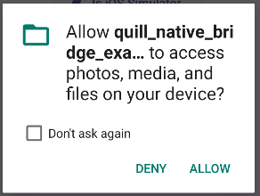
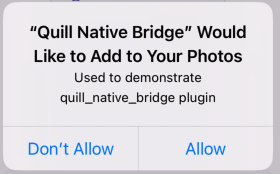

# 🪶 Quill Native Bridge

An internal Flutter plugin for [`flutter_quill`](https://pub.dev/packages/flutter_quill) package to access platform-specific APIs.

For details about the plugin architecture, refer to the [README of the repo](../README.md).

## ✨ Features

| Feature                  | iOS  | Android | macOS | Windows | Linux | Web   |
|--------------------------|------|---------|-------|---------|-------|-------|
| **isIOSSimulator**        | ✅   | ⚪      | ⚪    | ⚪      | ⚪    | ⚪    |
| **getClipboardHtml**      | ✅   | ✅      | ✅    | ✅      | ✅    | ✅    |
| **copyHtmlToClipboard**   | ✅   | ✅      | ✅    | ✅      | ✅    | ✅    |
| **copyImageToClipboard**  | ✅   | ✅      | ✅    | ❌      | ✅    | ✅    |
| **getClipboardImage**     | ✅   | ✅      | ✅    | ❌      | ✅    | ✅    |
| **getClipboardGif**       | ✅   | ✅      | ⚪    | ⚪      | ⚪    | ⚪    |
| **getClipboardFiles**     | ⚪   | ⚪      | ✅    | ❌      | ✅    | ❌    |
| **openGalleryApp**        | ✅   | ✅      | ✅    | ✅      | ⚪    | ⚪    |
| **saveImageToGallery**    | ✅   | ✅      | ✅    | ❌      | ⚪    | ⚪    |
| **saveImage**             | ⚪   | ⚪      | ✅    | ✅      | ✅    | ✅    |

- `⚪`: Not applicable, not expected, or unsupported on this platform (e.g., checking **iOS simulator** on **Android**, saving images to the gallery on the web, or retrieving GIFs on desktop/web).
- `❌`: The plugin doesn't currently implement it.
- `✅`: Supported and functional.

See the [API reference](https://pub.dev/documentation/quill_native_bridge/latest/) for more details.

## 📜 Usage

Some features require a platform-specific setup. See the [Setup](#-setup) section for details.

Always review the doc comment of a method before use for special notes.

Check if a method is supported on the platform/os version before using it:

```dart
if (await QuillNativeBridge.isSupported(QuillNativeBridgeFeature.copyHtmlToClipboard)) {
// Replace copyHtmlToClipboard with the method or functionality name
}
```

**To check if the iOS app is running on iOS simulator**:

```dart
import 'package:flutter/foundation.dart';

final isIOSApp = !kIsWeb && defaultTargetPlatform == TargetPlatform.iOS;

if (isIOSApp && await QuillNativeBridge.isIOSSimulator()) {
    // The app is running on an iOS simulator.
}
```

**To retrive the HTML from the system clipboard**:

```dart
final String? html = await QuillNativeBridge.getClipboardHtml(); // Null in case permission denied on iOS or HTML is not available
```

**To copy an HTML to the system clipboard**:

```dart
const exampleHtml = '<bold>Bold text</bold>';
await QuillNativeBridge.copyHtmlToClipboard(exampleHtml);
```

**To copy an image to the system clipboard**:

```dart
final Uint8List imageBytes = ...; // Load the image bytes

await QuillNativeBridge.copyImageToClipboard(imageBytes);
```

**To retrive the image from the system clipboard**:

```dart
final Uint8List? imageBytes = await QuillNativeBridge.getClipboardImage(); // Null if the image is not available

// OR a GIF image

final Uint8List? gifBytes = await QuillNativeBridge.getClipboardGif(); // Null if the image is not available
```

**To retrive copied files from the system clipboard on desktop**:

```dart
final List<String> filePaths = await QuillNativeBridge.getClipboardFiles(); // Empty list if no files are available
```

**To open the system gallery app**:

```dart
await QuillNativeBridge.openGalleryApp(); // Work only for platforms that have a system gallery app
```

**To save an image to the system gallery**:

```dart
final Uint8List imageBytes = ...; // Load the image bytes

await QuillNativeBridge.saveImageToGallery(imageBytes, name: 'ExampleImageName', extension: 'png', albumName: null); // Work only for platforms that have a system gallery app
```

**To save an image using save dialog on desktop or download it on web**:

```dart
final Uint8List imageBytes = ...; // Load the image bytes

await QuillNativeBridge.saveImage(imageBytes, name: 'ExampleImageName', extension: 'png'); // Doesn't work on mobile platforms
```

## 🔧 Setup

<!-- TODO(save-image): Update image URLs source to GitHub instead of relative path to work on pub.dev -->

Certain functionalities require a platform-specific configuration.
If this configuration is not properly set up in:

* **🛠️ Debug mode**: A warning will be displayed in the log with a link to this section.
* **🚀 Production mode**: An exception with fewer details will be thrown.

### 📋 Copying images to the system clipboard

> [!NOTE]
> This configuration is only required on **Android** platform for using `copyImageToClipboard`.
> For more information, refer to the [Android FileProvider documentation](https://developer.android.com/reference/androidx/core/content/FileProvider).

#### Android

<!-- TODO: Might remove this requirement, see https://github.com/flutter/packages/blob/main/packages/image_picker/image_picker_android/android/src/main/AndroidManifest.xml#L6-L14 and https://github.com/flutter/packages/blob/main/packages/image_picker/image_picker_android/android/src/main/res/xml/flutter_image_picker_file_paths.xml -->

**1. Update `AndroidManifest.xml`**

Open `android/app/src/main/AndroidManifest.xml` and add the following inside the `<application>` tag:

```xml
<manifest>
    <application>
        ...
        <provider
            android:name="androidx.core.content.FileProvider"
            android:authorities="${applicationId}.fileprovider"
            android:exported="false"
            android:grantUriPermissions="true" >
            <meta-data
                android:name="android.support.FILE_PROVIDER_PATHS"
                android:resource="@xml/file_paths" />
        </provider>
        ...
    </application>
</manifest>
```

**2. Create `file_paths.xml`**

Create the file `android/app/src/main/res/xml/file_paths.xml` with the following content:

```xml
<paths>
    <cache-path name="cache" path="." />
</paths>
```

### 🖼️ Saving images to the gallery

#### Android

Depending on the Android version, the app might need permission:

* **Android 10 (Api 29) and later**: The permission `android.permission.WRITE_EXTERNAL_STORAGE` is no longer supported or required. The plugin makes use of the [Android scoped storage](https://source.android.com/docs/core/storage/scoped), no runtime permission is needed.
* **Android 9 (API 28) and earlier**: Scoped storage is not supported. The `android.permission.WRITE_EXTERNAL_STORAGE` permission is still required, and both modifying the `AndroidManifest.xml` and requesting runtime permission are necessary for writing to external storage. **This setup is only needed for backward compatibility.**

To support previous versions,
open `android/app/src/main/AndroidManifest.xml` and add the following inside the `<manifest>` tag:

```xml
<manifest>
    ...
    <uses-permission
        android:name="android.permission.WRITE_EXTERNAL_STORAGE"
        android:maxSdkVersion="28" />
    ...
</manifest>
```

> [!TIP]
> The `maxSdkVersion` attribute must be set to `28` since this 
> is no longer required or supported on **Android 10 and later**.

The plugin will request permission from the user in runtime 
when `saveImageToGallery` is called and permission is not granted yet,
**but only on Android 9 (API 28) and earlier.**

An example of the permission dialog on **Android 9 (API 28) and earlier**, requesting write access to the external storage:



#### iOS

To save images to the gallery, the app needs permission, and the required permission depends on the **iOS version** and **whether the album name was specified**:

* `NSPhotoLibraryAddUsageDescription`: Permission to add images to the photo library, labeled as `Privacy - Photo Library Additions Usage Description` in Xcode. This key is available only on **iOS 14 and later** and is requested at runtime if no album name is specified, otherwise, it requests read-write permission (`NSPhotoLibraryUsageDescription`).
* `NSPhotoLibraryUsageDescription`: Read-write permission to the photos library, labeled as `Privacy - Photo Library Usage Description` in Xcode. This key has been available since **iOS 6** and is requested at runtime on **iOS 13 and earlier** (as add-only permission is unavailable) and is always requested if the album name is specified, even on **iOS 14 and later**.

> [!IMPORTANT]
> If the album name was specified, read-write permission (`NSPhotoLibraryUsageDescription`) is always required even on **iOS 14 and later**.

Open the file `/ios/Runner/Info.plist` and add the following keys inside the `<dict>` tag:

```plist
<!-- Add-only permission: Required on iOS 14 and later if the album name is not specified, explaining why the app needs add-only access to the photo library -->
<key>NSPhotoLibraryAddUsageDescription</key>
<string>Your description here</string>

<!-- Read-write permission: Always required on iOS 13 and earlier, and also required on iOS 14 and later if the album name is specified, explaining why the app needs read-write access to the photo library -->
<key>NSPhotoLibraryUsageDescription</key>
<string>Your description here</string>
```

> [!IMPORTANT]
> Replace `Your description here` with an explanation of why your app requires **add-only** or **read-write** access to the photo library (e.g., `Used to demonstrate quill_native_bridge plugin`). The comments in the template above are not required.

An example of the permission dialog on iOS 18, requesting access to **add-only** to the photo library without specifying the album name:



An example of the permission dialog on iOS 18, requesting
access to **read-write** when the app already has **add-only**, **read-write** is required when specifying the album name:


> [!TIP]
> If you've followed the [image_picker iOS setup](https://pub.dev/packages/image_picker#ios) instructions, you might have already added the `NSPhotoLibraryUsageDescription` key.

#### macOS

> [!IMPORTANT]
> This feature is supported on **macOS 10.15 and later**, currently, [the minimum supported version by Flutter is `10.14`](https://docs.flutter.dev/reference/supported-platforms). Use `isSupported()` to check before calling this method to avoid runtime exception.

To save images to the gallery, the app needs permission, and the required permission depends on the **macOS version** and **whether the album name was specified**:

* `NSPhotoLibraryAddUsageDescription`: Permission to add images to the photo library, labeled as `Privacy - Photo Library Additions Usage Description` in Xcode. This key is available only on **macOS 11 and later** and is requested at runtime if no album name is specified, otherwise, it requests read-write permission (`NSPhotoLibraryUsageDescription`).
* `NSPhotoLibraryUsageDescription`: Read-write permission to the photos library, labeled as `Privacy - Photo Library Usage Description` in Xcode. This key has been available since **macOS 10.14 (Mojave)** and is requested at runtime on **macOS 10.15 and earlier** (as add-only permission is unavailable) and is always requested if the album name is specified, even on **macOS 11 and later**.

> [!IMPORTANT]
> If the album name was specified, read-write permission (`NSPhotoLibraryUsageDescription`) is always required even on **macOS 11 and later**.

Open the file `/macos/Runner/Info.plist` and add the following keys inside the `<dict>` tag:

```plist
<!-- Add-only permission: Required on macOS 11 and later if the album name is not specified, explaining why the app needs add-only access to the photo library -->
<key>NSPhotoLibraryAddUsageDescription</key>
<string>Your description here</string>

<!-- Read-write permission: Always required on macOS 10.15 and earlier, and also required on macOS 11 and later if the album name is specified, explaining why the app needs read-write access to the photo library -->
<key>NSPhotoLibraryUsageDescription</key>
<string>Your description here</string>
```

> [!IMPORTANT]
> Replace `Your description here` with an explanation of why your app requires **add-only** or **read-write** access to the photo library (e.g., `Used to demonstrate quill_native_bridge plugin`). The comments in the template above are not required.

An example of the permission dialog on macOS 14, requesting access to **add-only** to the photo library without specifying the album name:


An example of the permission dialog on macOS 14, requesting
access to **read-write** when the macOS supports **add-only**, but **read-write** is always required when specifying the album name:


> [!WARNING]
> The permission is **always denied on macOS** while testing if you're running the app with [Android Studio IDE](https://developer.android.com/studio) or [VS Code](https://code.visualstudio.com/) even with the built-in terminal. This restriction is imposed by Apple macOS. However, this is not an issue when running the production app or in development using **Xcode** or **macOS terminal** (`flutter run -d macos`). See [flutter#134191](https://github.com/flutter/flutter/issues/134191) for more details.

### 💾 Saving images

This functionality differs from [Saving Images to the Gallery](#️-saving-images-to-the-gallery).
Instead of saving directly to the system gallery (the default behavior on mobile platforms).
The behavior varies by platform:

* **🌐 Web**: Downloads the file directly with the browser.
* **🖥️ Desktop**: Opens the native save dialog, allowing the user to specify where to save the file without runtime permission.

> [!NOTE]
> The plugin currently delegates to [file_selector_linux](https://pub.dev/packages/file_selector_linux) on **Linux desktop** or
[file_selector_windows](https://pub.dev/packages/file_selector_windows) on **Microsoft Windows** with the appropriate file
type set. Similarly to [image_picker](https://pub.dev/packages/image_picker#windows-macos-and-linux).

#### macOS

The implementation is using [`NSSavePanel`](https://developer.apple.com/documentation/appkit/nssavepanel) which requires an entitlement in sandboxed apps, add the following to `macos/Runner/Release.entitlements` and `macos/Runner/DebugProfile.entitlements`:

```xml
<key>com.apple.security.files.user-selected.read-write</key>
<true/>
```


> [!NOTE]
> No runtime permission is required.

> [!TIP]
> If you've followed the [image_picker macOS setup](https://pub.dev/packages/image_picker#ios) or [file_selector macOS setup](https://pub.dev/packages/file_selector#macos) instructions, you might have already added the `com.apple.security.files.user-selected.read-write` key.

## 🚧 Experimental

This package is in early development despite the version since it previously had the same version as [flutter_quill](https://pub.dev/packages/flutter_quill), now they have been separated. The [Flutter Quill](https://github.com/singerdmx/flutter-quill/tree/master/.github/workflows) publishing workflow releases one stable version for all packages even if no changes were introduced.

Fixing the version requires discounting the support for [quill_native_bridge](https://pub.dev/packages/quill_native_bridge) and publishing a new package.
